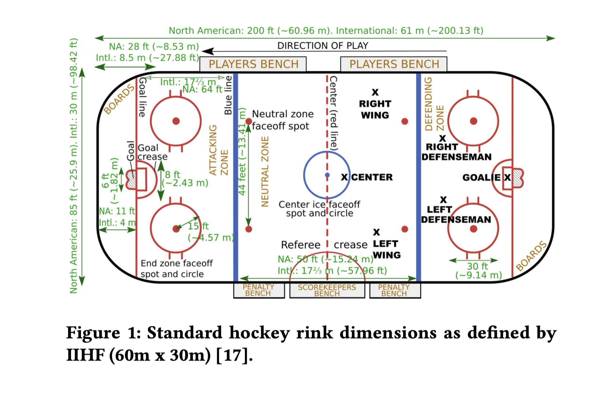
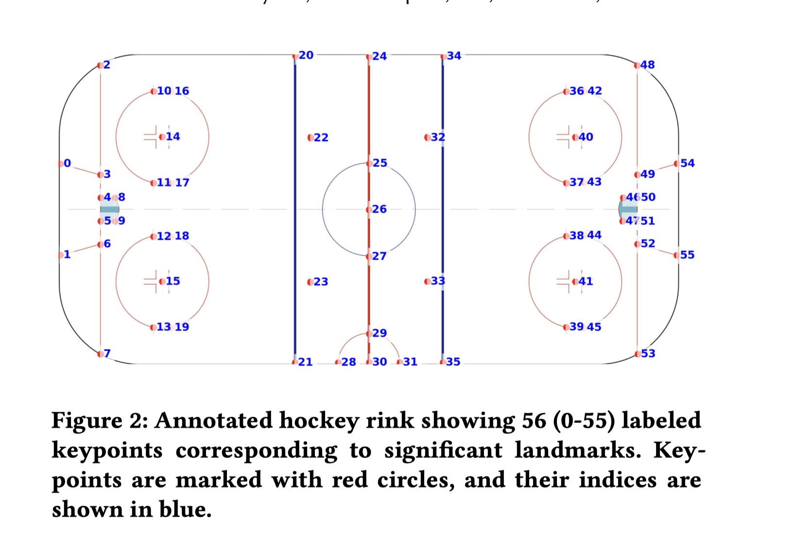

# HockeyRink Landmark and Coordinate Reference

## Purpose

Explain how HockeyRink keypoint predictions are mapped from
broadcast-image coordinates to physical rink coordinates for the
NHL Passing Networks project.

## Source

Houshmand Sarkhoosh et al. (2025)
"HockeyRink: A Dataset for Precise Ice Hockey Rink Keypoint
Mapping and Analytics"

IIHF Official Rule Book 2025/26
Appendix VI — Infographics
Page 222
File: 2025-26_iihf_rulebook_19052025-v1.pdf

## 1. Physical Rink Geometry

### Figure 1 — IIHF Standard Rink Dimensions

*Figure 1. Standard hockey rink dimensions as defined by the IIHF
(60 m × 30 m). Source: Houshmand Sarkhoosh et al. (2025),
HockeyRink.*

Physical dimensions:
- Length: 60 m
- Width: 30 m

### Coordinate Convention

- North: positive Y
- South: negative Y
- East: positive X
- West: negative X
- Origin: center-ice faceoff spot `(0.00, 0.00)`
- X-axis: rink length, from West `-30.00 m` to East `+30.00 m`
- Y-axis: rink width, from South `-15.00 m` to North `+15.00 m`
- Units: meters

## 2. HockeyRink Landmark System

### Figure 2 — 56 HockeyRink Keypoints

*Figure 2. HockeyRink annotation scheme showing the 56 canonical
rink landmarks, KP-0 through KP-55. Source: Houshmand Sarkhoosh
et al. (2025), HockeyRink.*

HockeyRink defines 56 fixed rink landmarks:

KP-0 through KP-55.

Only landmarks present in the current broadcast view are expected
to be observable.

## 3. Annotation Representation

Bounding box:
[class_id, x_center, y_center, width, height]

Keypoint:
(x_i, y_i, v_i)

Visibility:
0 = not present
1 = occluded
2 = visible

## 4. Keypoint Reference

### Rink Orientation Convention

Landmark names use the fixed orientation shown in Figure 2:

- North = top of the canonical rink diagram
- South = bottom of the canonical rink diagram
- West = left end of the canonical rink diagram
- East = right end of the canonical rink diagram

These directions refer to the canonical rink coordinate system and do
not change with broadcast camera orientation, camera panning or zooming,
or team direction of play.

### Physical Coordinate Convention

The center-ice faceoff spot is the origin `(0, 0)`.

- X measures position along the length of the rink.
- Negative X = West.
- Positive X = East.
- Y measures position across the width of the rink.
- Positive Y = North.
- Negative Y = South.
- Coordinates are expressed in meters.

For a 60 m × 30 m rink:

- West extreme: X = -30.00 m
- East extreme: X = +30.00 m
- North extreme: Y = +15.00 m
- South extreme: Y = -15.00 m
- Center ice: (0.00, 0.00)

### Faceoff Hash-Mark Convention

For end-zone faceoff-circle landmarks:

- `d` = defensive-side hash mark. The defending player occupies the
  side of the faceoff alignment closest to that end's goal.
- `o` = offensive-side hash mark. The attacking player faces the goal
  with the defending player positioned between the attacking player
  and the goal.

The `d` and `o` terms are project-specific descriptive terminology.
The canonical HockeyRink identifiers remain KP-0 through KP-55.

### Coordinate Source Convention

Unless otherwise noted, physical coordinates in this table are derived
from the IIHF Official Rule Book 2025/26, Appendix VI, p. 222.

- `IIHF-direct`: coordinate follows directly from a dimension shown in
  the IIHF rink diagram.
- `IIHF-derived`: coordinate is mathematically derived from dimensions
  shown in the IIHF rink diagram.
- `TBD`: coordinate has not yet been verified against authoritative
  rink geometry.

  ### Blue-Line Geometry Convention

For the IIHF 60 m × 30 m rink configuration, each blue line is
0.30 m wide.

Using the project coordinate system with center ice at `(0, 0)`:

Western blue line:
- Neutral-zone edge: X = -7.50 m
- Painted-line center: X = -7.65 m
- End-zone edge: X = -7.80 m

Eastern blue line:
- Neutral-zone edge: X = +7.50 m
- Painted-line center: X = +7.65 m
- End-zone edge: X = +7.80 m

For HockeyRink homography landmarks KP-20, KP-21, KP-34, and KP-35,
this project uses the geometric center of the 0.30 m painted blue line
as the canonical X coordinate.

This is a project convention for representing a finite-width painted
line as a single point coordinate. It does not redefine the physical
zone boundaries used by the rules of play.

For later zone-entry, zone-exit, and offside analysis, the appropriate
physical edge of the blue line should be used rather than the
painted-line center.

Source:
IIHF Official Rule Book 2025/26,
Appendix VI, p. 222,
`2025-26_iihf_rulebook_19052025-v1.pdf`.

> **Mapping status:** Semantic mapping complete (V1).
> Physical rink coordinate mapping complete for the IIHF 60 m × 30 m
> rink profile (56/56 HockeyRink keypoints).
> Coordinates were derived from documented IIHF rink geometry using
> center ice `(0, 0)` as the project coordinate origin rather than
> estimated from HockeyRink Figure 2.
> Source and derivation information is documented for each landmark.

### Landmark Dictionary

| KP | Project landmark name | X (m) | Y (m) | Description | Source / derivation |
|---:|---|---:|---:|---|---|
| 0 |west_trapezoid_line_north_board_intersection | -30.00 | +4.30 | One of two 5 cm wide red lines that run diagonally from the goal line to the boards. | IIHF-derived: board x=-30.00; 8.60/2=4.30 |
| 1 |west_trapezoid_line_south_board_intersection | -30.00 | -4.30 | One of two 5 cm wide red lines that run diagonally from the goal line to the boards. | IIHF-derived: board x=-30.00; -(8.60/2)=-4.30 |
| 2 |west_goal_line_north_board_intersection | -26.00 | +15.00 | The goal line is located 4.00 m from the end boards and extends across the width of the rink. | IIHF-derived, Appendix VI: x=-30.00+4.00=-26.00; north board y=+15.00 |
| 3 | west_trapezoid_line_north_goal_line_intersection | -26.00 | +3.40 | One of two 5 cm wide red lines that run diagonally from the goal line to the boards. | IIHF-derived: goal line x=-26.00; 6.80/2=3.40 |
| 4 | west_goalie_crease_line_north_goal_line_intersection | -26.00 | +1.22 | Northern intersection of the west goal crease boundary with the west goal line. | IIHF-derived: goal line x=-26.00; crease width 2.44 m; +2.44/2=+1.22 |
| 5 | west_goalie_crease_line_south_goal_line_intersection | -26.00 | -1.22 | Southern intersection of the west goal crease boundary with the west goal line. | IIHF-derived: goal line x=-26.00; crease width 2.44 m; -(2.44/2)=-1.22 |
| 6 | west_trapezoid_line_south_goal_line_intersection | -26.00 | -3.40 | One of two 5 cm wide red lines that run diagonally from the goal line to the boards. |  IIHF-derived: goal line x=-26.00; -(6.80/2)=-3.40 |
| 7 | west_goal_line_south_board_intersection | -26.00 | -15.00 | The goal line is located 4.00 m from the end boards and extends across the width of the rink. | IIHF-derived, Appendix VI: x=-30.00+4.00=-26.00; south board y=-15.0 |
| 8 | west_top_of_goalie_crease_north | -24.63 | +1.22 | Northern endpoint of the front boundary of the west goal crease. | IIHF Rule 1.7 / Appendix VI: goal line x=-26.00; straight crease side extends 1.37 m toward center, x=-26.00-1.37=-24.63; y=+1.22 |
| 9 | west_top_of_goalie_crease_south | -24.63 | -1.22 | Southern endpoint of the front boundary of the west goal crease. | IIHF Rule 1.7 / Appendix VI: goal line x=-26.00; straight crease side extends 1.37 m toward center, x=-26.00-1.37=-24.63; y=-1.22 |
| 10 | western_end_zone_north_d_fo_hash_mark_north | -20.90 | +11.50 | Northern endpoint of the d-side hash-mark pair associated with the north faceoff circle in the western end zone. | IIHF-derived, Appendix VI: faceoff center=(-20.00,+7.00); d-side x=-20.00-0.90=-20.90; north y=+7.00+4.50=+11.50 |
| 11 | western_end_zone_north_d_fo_hash_mark_south | -20.90 | +2.50 | Southern endpoint of the d-side hash-mark pair associated with the north faceoff circle in the western end zone. | IIHF-derived, Appendix VI: faceoff center=(-20.00,+7.00); d-side x=-20.00-0.90=-20.90; south y=+7.00-4.50=+2.50 |
| 12 | western_end_zone_south_d_fo_hash_mark_north | -20.90 | -2.50 | Northern endpoint of the d-side hash-mark pair associated with the south faceoff circle in the western end zone. | IIHF-derived, Appendix VI: faceoff center=(-20.00,-7.00); d-side x=-20.00-0.90=-20.90; north y=-7.00+4.50=-2.50 |
| 13 | western_end_zone_south_d_fo_hash_mark_south | -20.90 | -11.50 | Southern endpoint of the d-side hash-mark pair associated with the south faceoff circle in the western end zone. | IIHF-derived, Appendix VI: faceoff center=(-20.00,-7.00); d-side x=-20.00-0.90=-20.90; south y=-7.00-4.50=-11.50 |
| 14 | western_end_zone_fo_dot_north | -20.00 | +7.00 | Center faceoff dot of the north faceoff circle in the western end zone. | IIHF-derived: -26.00 + 6.00 = -20.00 |
| 15 | western_end_zone_fo_dot_south | -20.00 | -7.00 | Center faceoff dot of the south faceoff circle in the western end zone. | IIHF-derived: -26.00 + 6.00 = -20.00  |
| 16 | western_end_zone_north_o_fo_hash_mark_north | -19.10 | +11.50 |  Northern endpoint of the o-side hash-mark pair associated with the north faceoff circle in the western end zone. | IIHF-derived, Appendix VI: faceoff center=(-20.00,+7.00); o-side x=-20.00 + 0.90=-19.10; north y=+7.00+4.50=+11.50 |
| 17 | western_end_zone_north_o_fo_hash_mark_south | -19.10 | +2.50 | Southern endpoint of the o-side hash-mark pair associated with the north faceoff circle in the western end zone. | IIHF-derived, Appendix VI: faceoff center=(-20.00,+7.00); o-side x=-20.00 + 0.90=-19.10; south y=+7.00-4.50=+2.50 |
| 18 | western_end_zone_south_o_fo_hash_mark_north | -19.10 | -2.50 | Northern endpoint of the o-side hash-mark pair associated with the south faceoff circle in the western end zone. | IIHF-derived, Appendix VI: faceoff center=(-20.00,-7.00); o-side x=-20.00 + 0.90=-19.10; north y=-7.00+4.50=-2.50  |
| 19 | western_end_zone_south_o_fo_hash_mark_south | -19.10 | -11.50 | Southern endpoint of the o-side hash-mark pair associated with the south faceoff circle in the western end zone. | IIHF-derived, Appendix VI: faceoff center=(-20.00,-7.00); o-side x=-20.00+0.90=-19.10; south y=-7.00-4.50=-11.50 |
| 20 | western_blue_line_north_board_intersection | -7.65 | +15.00 | Northern board intersection of the western blue line; project coordinate uses the center of the 0.30 m painted blue line. | IIHF Official Rule Book 2025/26, Appendix VI, p. 222: neutral-zone edge x=-7.50; blue-line width=0.30 m. Project convention: use painted-line center, x=-7.50-0.15=-7.65; north board y=+15.00 |
| 21 | western_blue_line_south_board_intersection | -7.65 | -15.00 | Southern board intersection of the western blue line; project coordinate uses the center of the 0.30 m painted blue line. | IIHF Official Rule Book 2025/26, Appendix VI, p. 222: neutral-zone edge x=-7.50; blue-line width=0.30 m. Project convention: use painted-line center, x=-7.50-0.15=-7.65; south board y=-15.00 |
| 22 | west_neutral_zone_north_faceoff_dot| -6.00 | +7.00 | Faceoff dot immediately east of the western blue line, north side |IIHF-direct: Official Rule Book 2025/26, Appendix VI, p. 222; neutral-zone faceoff spot is 6.00 m west of center red line and 7.00 m north of longitudinal center axis |
| 23 | west_neutral_zone_south_faceoff_dot | -6.00 | -7.00 | Faceoff dot immediately east of the western blue line, south side | IIHF-direct: Official Rule Book 2025/26, Appendix VI, p. 222; neutral-zone faceoff spot is 6.00 m west of center red line and 7.00 m south of longitudinal center axis|
| 24 | center_red_line_north_board_intersection | 0.00 | +15.00 | Intersection of the center red line with the north boards. | IIHF-derived: Official Rule Book 2025/26, Appendix VI, p. 222; center red line x=0.00; 30.00 m rink width gives north board y=+15.00 |
| 25 | center_ice_faceoff_circle_north_hash_marks | 0.00 | +4.50 | Northern intersection of the center red line with the center faceoff circle. | IIHF-derived: Rule 1.9 / Appendix VI; center faceoff circle radius=4.50 m about origin (0.00,0.00); northern intersection=(0.00,+4.50) |
| 26 | center_ice_faceoff_spot | 0.00 | 0.00 | Center faceoff spot at the geometric center of the rink. | IIHF-direct: Rule 1.9 / Appendix VI; center-ice faceoff spot; project coordinate origin=(0.00,0.00) |
| 27 | center_ice_faceoff_circle_south_hash_marks | 0.00 | -4.50 | Southern intersection of the center red line with the center faceoff circle. | IIHF-derived: Rule 1.9 / Appendix VI; center faceoff circle radius=4.50 m about origin (0.00,0.00); southern intersection=(0.00,-4.50) |
| 28 | western_point_of_referee_crease | -3.00 | -15.00 | Western endpoint of the referee crease along the south boards. | IIHF-derived: Rule 1.8 / Appendix VI, Officials' Crease; radius=3.00 m centered on center red line at south board (0.00,-15.00); western endpoint=(-3.00,-15.00) |
| 29 | top_of_referee_crease | 0.00 | -12.00 | Northernmost point of the referee crease. | IIHF-derived: Rule 1.8 / Appendix VI, Officials' Crease; radius=3.00 m centered at (0.00,-15.00); apex y=-15.00+3.00=-12.00 |
| 30 | center_red_line_south_board_intersection | 0.00 | -15.00 | Intersection of the center red line with the south boards. | IIHF-derived: Official Rule Book 2025/26, Appendix VI, p. 222; center red line x=0.00; 30.00 m rink width gives south board y=-15.00 |
| 31 | eastern_point_referee_crease | +3.00 | -15.00 | Eastern endpoint of the referee crease along the south boards. | IIHF-derived: Rule 1.8 / Appendix VI, Officials' Crease; radius=3.00 m centered on center red line at south board (0.00,-15.00); eastern endpoint=(+3.00,-15.00) |
| 32 | east_neutral_zone_north_faceoff_dot | +6.00 | +7.00 | Faceoff dot immediately west of the eastern blue line, north side | IIHF-direct: Official Rule Book 2025/26, Appendix VI, p. 222; neutral-zone faceoff spot is 6.00 m east of center red line and 7.00 m north of longitudinal center axis |
| 33 | east_neutral_zone_south_faceoff_dot | +6.00 | -7.00 | Faceoff dot immediately west of the eastern blue line, south side | IIHF-direct: Official Rule Book 2025/26, Appendix VI, p. 222; neutral-zone faceoff spot is 6.00 m east of center red line and 7.00 m south of longitudinal center axis |
| 34 | eastern_blue_line_north_board_intersection | +7.65 | +15.00 | Northern board intersection of the eastern blue line; project coordinate uses the center of the 0.30 m painted blue line. | IIHF Official Rule Book 2025/26, Appendix VI, p. 222: neutral-zone edge x=+7.50; blue-line width=0.30 m. Project convention: use painted-line center, x=+7.50+0.15=+7.65; north board y=+15.00 |
| 35 | eastern_blue_line_south_board_intersection | +7.65 | -15.00 | Southern board intersection of the eastern blue line; project coordinate uses the center of the 0.30 m painted blue line. | IIHF Official Rule Book 2025/26, Appendix VI, p. 222: neutral-zone edge x=+7.50; blue-line width=0.30 m. Project convention: use painted-line center, x=+7.50+0.15=+7.65; south board y=-15.00 |
| 36 | eastern_end_zone_north_o_fo_hash_mark_north | +19.10 | +11.50 | Northern endpoint of the o-side hash-mark pair associated with the north faceoff circle in the eastern end zone. | IIHF-derived, Appendix VI: faceoff center=(+20.00,+7.00); o-side x=+20.00-0.90=+19.10; north y=+7.00+4.50=+11.50 |
| 37 | eastern_end_zone_north_o_fo_hash_mark_south | +19.10 | +2.50 | Southern endpoint of the o-side hash-mark pair associated with the north faceoff circle in the eastern end zone. | IIHF-derived, Appendix VI: faceoff center=(+20.00,+7.00); o-side x=+20.00-0.90=+19.10; south y=+7.00-4.50=+2.50  |
| 38 | eastern_end_zone_south_o_fo_hash_mark_north | +19.10 | -2.50 | Northern endpoint of the o-side hash-mark pair associated with the south faceoff circle in the eastern end zone. | IIHF-derived, Appendix VI: faceoff center=(-20.00,-7.00); o-side x=+20.00-0.90=+19.10; north y=-7.00+4.50=-2.50 |
| 39 |  eastern_end_zone_south_o_fo_hash_mark_south | +19.10 | -11.50 | Southern endpoint of the o-side hash-mark pair associated with the south faceoff circle in the eastern end zone. | IIHF-derived, Appendix VI: faceoff center=(-20.00,-7.00); o-side x=+20.00-0.90=+19.10; south y=-7.00-4.50=-11.50 |
| 40 | eastern_end_zone_fo_dot_north | +20.00 | +7.00 | Center faceoff dot of the north faceoff circle in the eastern end zone. | IIHF-derived: +26.00 + -6.00 = +20.00 |
| 41 | eastern_end_zone_fo_dot_south | +20.00 | -7.00 | Center faceoff dot of the south faceoff circle in the eastern end zone. | IIHF-derived: +26.00 + -6.00 = +20.00 |
| 42 | eastern_end_zone_north_d_fo_hash_mark_north | +20.90 | +11.50 | Northern endpoint of the d-side hash-mark pair associated with the north faceoff circle in the eastern end zone. | IIHF-derived, Appendix VI: faceoff center=(+20.00,+7.00); d-side x=+20.00+0.90=+20.90; north y=+7.00+4.50=+11.50 |
| 43 | eastern_end_zone_north_d_fo_hash_mark_south | +20.90 | +2.50 | Southern endpoint of the d-side hash-mark pair associated with the north faceoff circle in the eastern end zone. | IIHF-derived, Appendix VI: faceoff center=(+20.00,+7.00); d-side x=+20.00+0.90=+20.90; south y=+7.00-4.50=+2.50 |
| 44 | eastern_end_zone_south_d_fo_hash_mark_north | +20.90 | -2.50 | Northern endpoint of the d-side hash-mark pair associated with the south faceoff circle in the eastern end zone. | IIHF-derived, Appendix VI: faceoff center=(+20.00,-7.00); d-side x=+20.00+0.90=+20.90; north y=-7.00+4.50=-2.50 |
| 45 | eastern_end_zone_south_d_fo_hash_mark_south | +20.90 | -11.50 | Southern endpoint of the d-side hash-mark pair associated with the south faceoff circle in the eastern end zone. | IIHF-derived, Appendix VI: faceoff center=(+20.00,-7.00); d-side x=+20.00+0.90=+20.90; south y=-7.00-4.50=-11.50 |
| 46 | east_top_of_goalie_crease_north | +24.63 | +1.22 | Northern endpoint of the front boundary of the east goal crease. | IIHF Rule 1.7 / Appendix VI: goal line x=+26.00; straight crease side extends 1.37 m toward center, x=26.00-1.37=24.63; y=+1.22  |
| 47 | east_top_of_goalie_crease_south | +24.63| -1.22 | Southern endpoint of the front boundary of the east goal crease. | IIHF Rule 1.7 / Appendix VI: goal line x=+26.00; straight crease side extends 1.37 m toward center, x=26.00-1.37=24.63; y=-1.22 |
| 48 | east_goal_line_north_board_intersection | +26.00 | +15.00 | The goal line is located 4.00 m from the end boards and extends across the width of the rink. | IIHF-derived, Appendix VI: x=+30.00-4.00=+26.00; north board y=+15.00 |
| 49 | east_trapezoid_line_north_goal_line_intersection | +26.00 | +3.40 | One of two 5 cm wide red lines that run diagonally from the goal line to the boards. | IIHF-derived: east/west symmetry of KP-3 |
| 50 | east_goalie_crease_line_north_goal_line_intersection | +26.00 | +1.22 | Northern intersection of the east goal crease boundary with the east goal line. | IIHF-derived: east/west symmetry of KP-4 |
| 51 | east_goalie_crease_line_south_goal_line_intersection | +26.00 | -1.22 | Southern intersection of the east goal crease boundary with the east goal line. | IIHF-derived: east/west symmetry of KP-5 |
| 52 | east_trapezoid_line_south_goal_line_intersection | +26.00 | -3.40 | One of two 5 cm wide red lines that run diagonally from the goal line to the boards. | IIHF-derived: east/west symmetry of KP-6 |
| 53 | east_goal_line_south_board_intersection | +26.00 | -15.00 | The goal line is located 4.00 m from the end boards and extends across the width of the rink. | IIHF-derived, Appendix VI: x=+30.00-4.00=+26.00; south board y=-15.00 |
| 54 | east_trapezoid_line_north_board_intersection | +30.00 | +4.30 | One of two 5 cm wide red lines that run diagonally from the goal line to the boards. | IIHF-derived: east/west symmetry of KP-0 |
| 55 | east_trapezoid_line_south_board_intersection  | +30.00 | -4.30 | One of two 5 cm wide red lines that run diagonally from the goal line to the boards. | IIHF-derived: east/west symmetry of KP-1 |

## 5. HockeyRink Inference

For each predicted keypoint:

KP index
→ pixel coordinate
→ confidence
→ canonical rink landmark

## 6. Homography

Known rink landmarks provide correspondences:

image pixel (x, y)
↔
physical rink (x_m, y_m)

These correspondences are used to estimate the image-to-rink
homography.

## 7. Player Location

BoT-SORT bounding box
→ lower-center skate proxy
→ image coordinate
→ homography
→ physical rink coordinate

## 8. Validation Notes

Document SHL → Swiss National League model-transfer experiments,
confidence thresholds, failure cases, camera movement, and
occlusions.